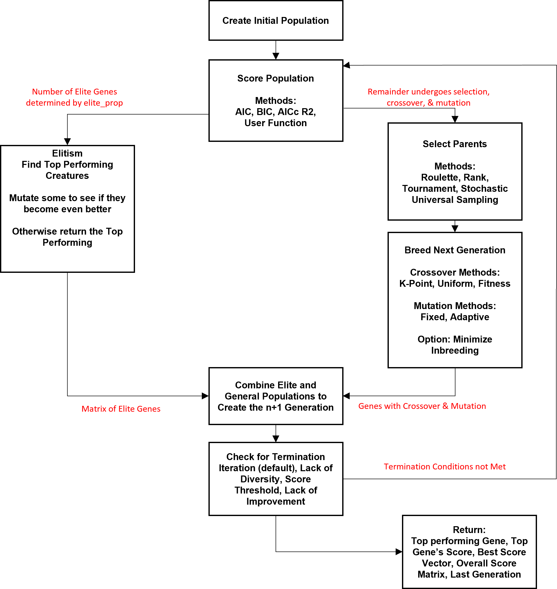
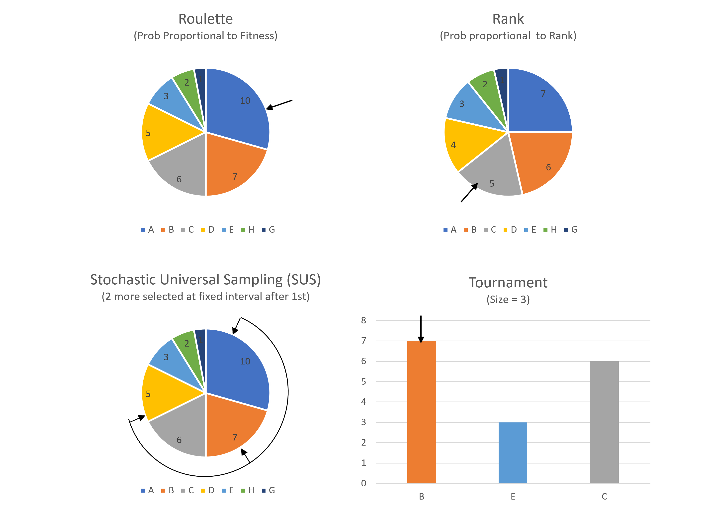
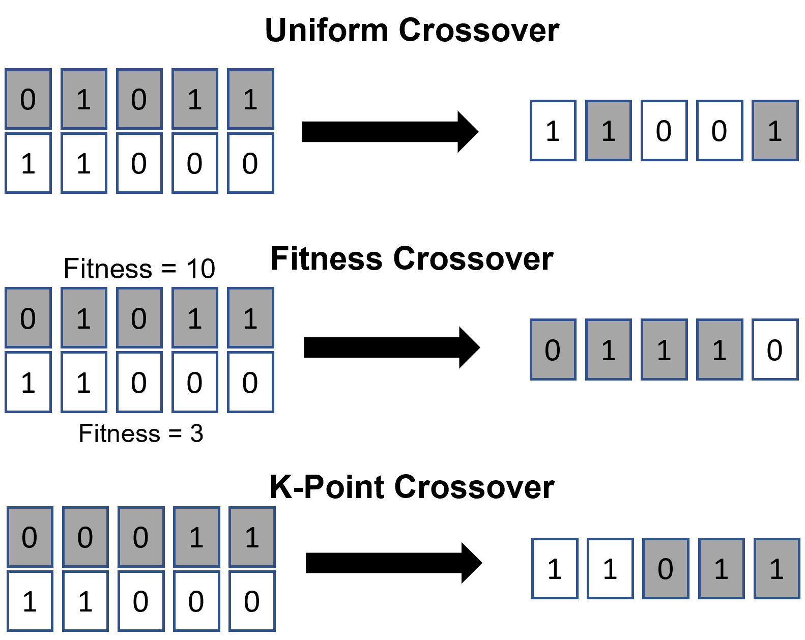
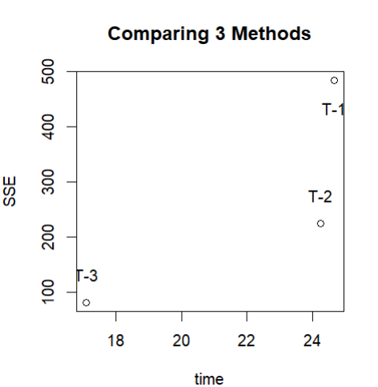
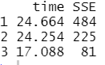

```{r setup, include=FALSE}
knitr::opts_chunk$set(echo = TRUE)
```

```{r eval = FALSE, include = FALSE}
library(GA)
source('reportDemo.R')
```

**Repository:** https://github.berkeley.edu/andrew-c-ma/genetic-algo

**Installation:** ‘R CMD INSTALL GA’

\centering
__Abstract__ 

\raggedright
This paper explores the creation of a genetic algorithm for feature selection in multivariate regression models followed by images and examples of its deployment. While stable methods such as step-wise regression are sure to converge to an optimal solution for feature selection problems, genetic algorithms have an advantage over regression models for models with large numbers of covariates. Step-wise regression algorithms must test every single combination of features in order to arrive at the optimal solution, while genetic algorithms may converge to a candidate solution much quicker with less computational cost, leading large increases in computational efficiency.

\centering
 __Introduction__ 
 
\raggedright
Our package allows for the implementation of genetic algorithms with the goal of selecting optimal feature combinations resulting in the highest 'fitness' metric for generalized regression models. 

The structure of our GA package is modular and uses vectorized calculations for efficiency and speed. While largely functional, our program does use some object oriented programming such as the ability to pass user-defined function between various supporting functions and the utilization of function outputs as objects in other helper functions. This streamlined approach can be seen in _Fig 1._ below, where each step produces an object that can be read into the next step of our algorithm. 
  
Finally, we chose binary encoding for genes because each linear regression model either does or does not have any given feature; a bit-wise encoding scheme is both efficient and effective for feature selection problems due to its simplistic and intuitive adaptation.  

\centering
__Design & Development__ 



\raggedright
As shown above in _Fig. 1_, we create an initial generation of genes with a desired population size and 0-1 assignment probability between 0 and 1. For each iteration, we score the fitness of the entire population - if elitism is selected, the top proportion of the population is protected from randomized selection, via the `apply_elitism()` function. The remainder of the population undergoes a parent selection process, followed by crossover and mutation. This results in the $n+1^{th}$ generation, which undergoes a termination check - if predetermined conditions are not met, we loop through this process again to engender new generations of genes. 

\centering
__Population Initialization & Termination Conditions__ 

\raggedright
Before the deployment of a genetic algorithm, there are several issues surrounding the initialization of the first generation. Our helper functions create generation matrix with rows representing the individual creatures and column representing the number of genes. As mentioned above, the presence of a feature is indicated by a '1' in the indexed position, and '0' for its absence. However, if one feels strongly about a particular sequence of genes, custom user inputs for population elements is also available as a parameter. 

Default parameters were chosen based on convention - mutation rates were set at 0.03 and crossover at 0.9. Moreover, we are utilizing binary encoding due to our goal being the optimal selection of features. Due to the heavy dependence on context, parameter initialization for GA’s must be carefully considered, alongside factors such as population size, termination conditions,etc.

Finally, there are three termination conditions, which we are checking at the end of each generation after the first. The conditions are:

* Max number of generations reached 

* Variance of our fitness scores is less than a constant close to 0 - this implies a lack of diversity within our population or arrival at an estimate that is close to the true solution

* Convergence to the true fitness value, shown through no consistent improvement of fitness scores through the generations

\centering
__The Creation of a New Generation__

\raggedright
Next, we will explain the functionality of our scoring, crossover, and mutation functions, which are applied to each generation of genes.  As seen in _Fig 1._, there is a divergence of data after the scoring step, where $crossover\ percentage = 1 - elitism\ percentage$. Genes that fall under our elitism criteria undergo mutation, but are guaranteed a place in the $n+1^{th}$ generation. 

For genes that undergo normal parent selection, there are a multitude of available methods available to users:

  1. Roulette - selects parents randomly proportionally to their fitness; this process favors parents with the highest fitness
  2. Rank - selects parents proportional to their rank, similar to Roulette but proportions are not assigned randomly
  3. Tournament - selects n candidates at random and the fittest from filtered pool becomes a parent
  4. Stochastic Universal Sampling - works like roulette but a user specified number of parents are selected at a fixed interval afterwards



After the parents are chosen, there exist a multitude of crossover parameters which may also be chosen by the user. For simplicity’s sake, ‘uniform’ seems to be safest with a default of two parents creating offspring. However, other recognized crossover methods include fitness & k-point; Uniform Crossover selects each individual gene of the next offspring one at a time assigning it from a parent randomly at a proportion equal to the number of parents. Fitness generates each individual gene randomly from a parent proportionally to the fitness of each parent. K-Point crossover breaks the gene at k points, and randomly assigns each point to one of the parents, the offspring being the combination of those segments. k = 1 is a 1-point crossover. See _Fig 3._



Lastly, mutation is applied at either a fixed or adaptive rate. Fixed mutation mutates each gene allele of every gene in the population at a fixed rate, while adaptive mutation allows for changes in the mutation rate based on the diversity of the population. Parameters associated with mutation include maximum mutation rate, a minimum mutation rate and an inflection point to generate a logistic function of the populations diversity.

One area associated with mutation worth investigating would be the **minimization of inbreeding**; this involves comparisons of parents before breeding to ensure that there are sufficient differences between the sequence of genes. Parent-pairs with high levels of similarity are penalized, and this leads to an increase in diversity. 


\centering
__Testing & Examples__

\raggedright
This section contains multiple examples of applications with our package. The first two are from select()'s help function (`?select`). In the third example we use a much large data sample from generate_data() and implement the adaptive mutation and minimize inbreeding. Immediately below is an example of the code being ran. For conciseness, we load the functions using `source('reportDemo.R')` and the code can be reviewed in our [Github](https://github.com/AndrewM1130/GA/blob/main/Analysis/reportDemo.R).

``` {r eval=FALSE, include = FALSE}
out3 <- select(
  total_number_generations=total_number_generations,
  number_of_parents = number_of_parents,
  pop=pop,
  gene_length=gene_length,
  prob = prob,
  user_genes = NULL,
  response_vec = response_vec,
  independent_vars =independent_vars,
  method = method,
  tourn_size = 4,
  mutation = mutation,
  mutation_rate = mutation_rate,
  minimize_inbreeding = minimize_inbreeding,
  crossover = crossover,
  elitism = TRUE,
  elite_prop = elite_prop,
  ad_max_mutate = ad_max_mutate,
  ad_min_mutate = ad_min_mutate,
  ad_inflection = ad_inflection,
  ad_curve = ad_curve,
  estimator = estimator,
  pause_length = pause_length,
  percent_converge = percent_converge)

plot(out3[[3]],xlab="generation",ylab="AIC, Most Fit Creature")
```

We did a lot of initial research into different methods for genetic algorithms. At an cursory level, any genetic algorithm design has to balance speed of convergence and computational complexity. The code for this final example is available in 'Final_Demo.R' but since it is time consuming and lengthy in code length we chose not to knit. In this last example we compare three methods:

 - Method 1: Fast - two parents, 1-point crossover, high elitism, high mutation
 - Method 2: Multi-Parent - four parents, lower elitism, lower mutation, uniform crossover
 - Method 3: Adaptive - two parents lower elitism, adaptive mutation, minimize inbreeding.
 


For this experiment, we use the data from generate_data() which is designed in such a way that the coefficients from features decrease from 1 to 50. See ?generate_data. We run each method five times taking the average system.time and also scoring the SSE using the formula below:

$SSE = \sum_{i = 1}^{n}(y_i - \hat{y_i})^2$



 We see that maintaining diversity had better results (minimizing SSE). However we also see that elitism appears to be computationally wasteful. If we went back and added additional features we could make the mutation in elitism optional which should speed up the processes.

``` {r SSE scoring, eval=FALSE, include = FALSE}
test_out_results<- function(list_o) {
  iter <- length(list_o)
  final <- iter
  b<-c(rep(1,25),rep(0,25))

    for (i in 1:iter) {
      if (is.vector(list_o[[i]])) {
        a <- list_o[[1]]

        } else {
          a <- list_o[[i]][1,]
          }
      final[i] <-  sum(abs(a-b))^2
    }
  return(mean(final))
  }
```

Finally, let's explore the rate of convergence alongside the effect of parent selection methods on convergence rate:

 

 \

From these results, we are confident that our genetic algorithm arrives at an optimal solution for feature selection problems with a linear decreasing rate. It seems that SUS converges to an optimal solution the fastest through large increases in the fitness levels. On the other hand, rank is a sure and steady method which follows rate. We also see that issues of premature convergence have been avoided with the use of crossover and forced variance(diversity) within members of each generation. 

\centering
__Challenges & Future Possibilities__ 

\raggedright
In this section, we will discuss challenges faced during the implementation of GA’s followed by possible research directions for those who wish to dig deeper. With respect to our specific algorithm, we believe that there may be options for the implementation of parallelization - for example, the distribution of fitness scoring to multiple workers presents itself as an embarrassingly-parallel problem. 

Furthermore, there are numerous challenges inherently commonly associated with genetic algorithms; many of these are influenced by our chosen parameters. Extensive research done by researchers at the University of Taluk[4] suggests that parameters must be proportional to the population size and number of generations, where unique setups such as 90% mutation / 10% crossover are optimal for models with low population numbers and large numbers of iterations, while 1% mutation / 99% crossover converge quicker for setups with large populations and finite iterations. The consequences of these parameter settings include premature convergence, local minima, and max iterations.

Many of the issues discussed above have no known definitive solutions; as of today, researchers are implementing GA’s with adaptive crossover and mutation rates. One can also imagine the combination of GA’s with Monte-Carlo simulation methods, where GA’s are run in parallel with different parameters to arrive at converging and similar solutions; this would require deeper research into possible implementations of nested parallelization and efficient storage of data & results of simulated GA’s for comparison. 

\centering
__References__ 

\raggedright

1. Eiben, A. & Rau, P-e & Ruttkay, Zsófia. (1997). Genetic Algorithms With Multi-Parent Recombination.

2. Givens, G. H., & Hoeting, J. A. (2012). Computational Statistics: Givens/computational statistics (2nd ed.). Wiley-Blackwell.

3. Hassanat, A., Almohammadi, K., Alkafaween, E., Abunawas, E., Hammouri, A., & Prasath, V. B. S. (2019). Choosing mutation and crossover ratios for genetic algorithms—A review with a new dynamic approach. Information (Basel), 10(12), 390. https://doi.org/10.3390/info10120390

4. Katoch, S., Chauhan, S. S., & Kumar, V. (2020). A review on genetic algorithms: past, present, and future. Multimedia Tools and Applications, 80(5), 1–36. https://doi.org/10.1007/s11042-020-10139-6

5. Trejos, Javier & Villalobos-Arias, Mario & Espinoza, Jose. (2016). Variable Selection in Multiple Linear Regression Using a Genetic Algorithm. 10.4018/978-1-4666-9644-0.ch005. 

6. Umbarkar, Dr. Anantkumar & Sheth, P.. (2015). CROSSOVER OPERATORS IN GENETIC ALGORITHMS: A REVIEW. ICTACT Journal on Soft Computing ( Volume: 6 , Issue: 1 ). 6. 10.21917/ijsc.2015.0150. 


